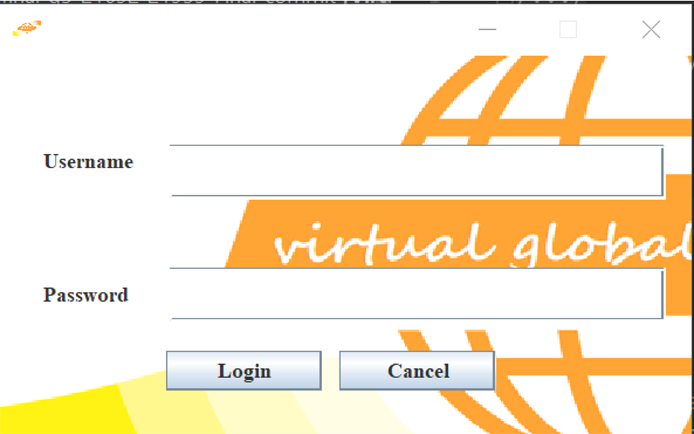
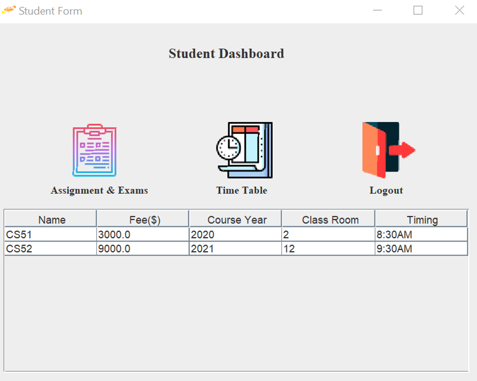
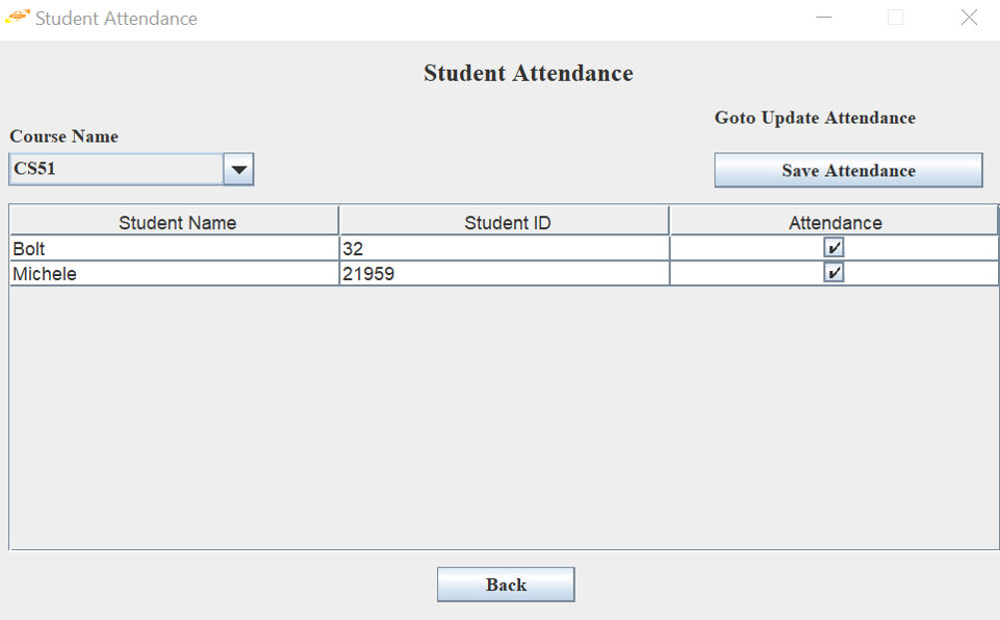
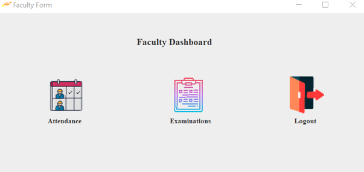
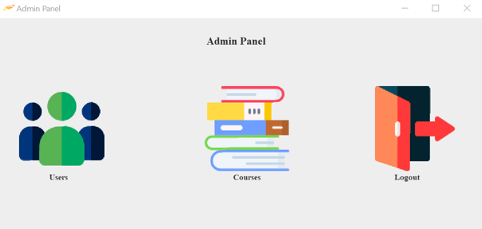
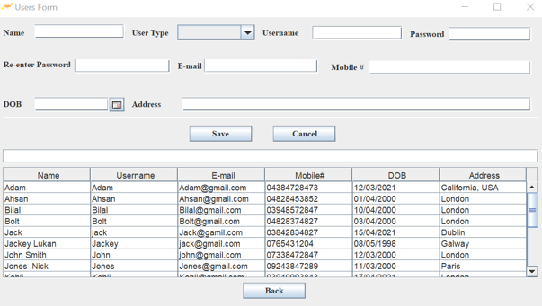
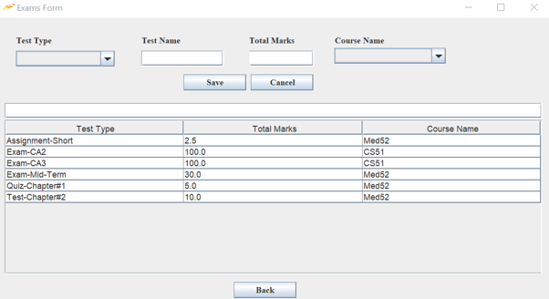
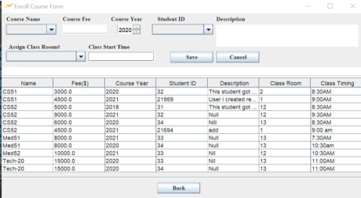

## JAVA PROJECT - FINAL CA

## Lecturer: 
John Rowley  

## Students:
21694 - Mubasher Khan  
21959 - Michele Sousa  

## Links
GitHub Link:
https://github.com/21959Michele/oop-ca-final-g5-21692-21959

Working Project YouTube Link: https://www.youtube.com/watch?v=yfEHTGEIK7o

Database link: https://dorsetdemo-my.sharepoint.com/:f:/g/personal/21959_student_dorset-college_ie/EqdMGXSMN6ZHs5XF1ErJlz4Bcjo9dy6uOHA6rAlcF_UoTg?e=Oy6K6J  

 In order to connect the database go localhost in any browser and click PhpMyadmin, then click on new and write the same name as the database provided, then go ahead and upload the databse provided it should all work fine after uploading database to local host in xampp. 

Xampp tutorial Youtube Link: https://youtu.be/DiBuH_H20NA

 Download xxamp from google and install it. Run the xampp and start apache and mysql servers. Just to keep in mind that sql uses 3306 port which has to be vacant in order for xampp to work.  
If sql workbench is running , xampp will not run. Workbench must be stopped from task manager first before running xampp server.  
Another point is that when creating new databse in local host name must be same as the database provided. And then import the database from the downloaded location. Then run the servers from xampp control.

## Project Description

 This is a GUI based application called Virtual Global College.  
This application is entirely created by using Jframes in java. For the purpose of storing the data, database was created. For the connection of the database Xxamp was used because we were having problems with mysql workbench. So, we decided to use Xampp as it was easier alternative option.  
This application is built in a way that we have different forms but no matter which form you run you will have to go through login page.   
Which means that only registered logins will be able to access. Application will open the forms according to the login details entered. Once the admin is logged in, he can create new users and allow them access. Everyone will only see their respective details, for instance students will only see their student details in order to access other features you will have to logout and login again with the respective id.  
To run the application connection to the database is required will be provided in the final submit. There are some jar files used to connect the database and for the calendar in one of the forms. Those jar files are needed to be mapped according to the user computer in order to work properly.

#### For testing, required logins are given below:

##### Admin:  
Username: Luke		Password: 12345678  
##### Student: 
Username: Bolt		Password: 12345678 
##### Faculty: 
Username: Jackey		Password: 12345678 

## UML Diagram  

## GUI APLICATION  

## Resources:

https://www.youtube.com/watch?v=QR-JaMTFB8c  
https://www.youtube.com/watch?v=Tch-CpttcOc  
https://www.youtube.com/watch?v=El939Eu0Z70  
